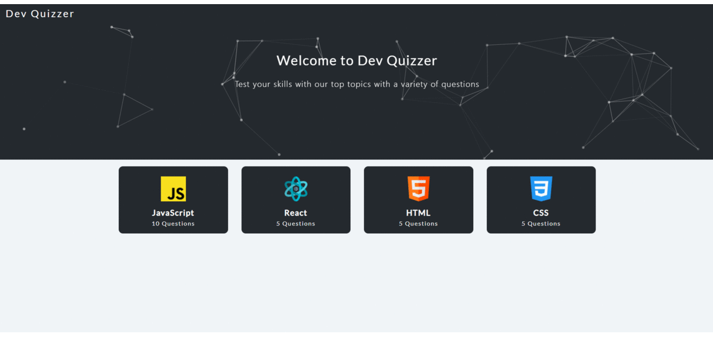

# Dev Quizzer

A simple quiz application for devs to brush up their skills. Built as an experimental project utilizing Typescript, minimal Apollo & Graphql.

### Features

- Landing page listed with available quizes and fancy particle banner
- Quiz page with navigation to next and previous questiosn
- Result page with details of your performance in the Quiz

### Tech Stack

- React Typescript
- Apollo GraphQl

### Reflection

This was a simple yet an interesting project to work on. A good learning curve which made me delve into Typescript on the first part and then into graphql. It helped me understand the problems that both technologies try to solve.

Adding typescript helped me realise different factors to consider at every level i.e possibility of empty data, type mutations which have to be carefully considered when not using typescript. Type is the single source truth of how Typescript compiler will evaluate your code, so lying about a type or adding it as `any` defeats the purpose.

Graphql has caught my interest now!.Exposed to this new paradigm, I have a lot to learn about it's core mechanics.
To keep it simple one major thing Graphql tries to solve is over/under fetching of data. This gives more power and ability to the client, helping take independent design decision for the data. The InMemoryCache amazed me, it does not bother fetching already fetched data. More to read and more to explore.

### Upcoming Features

- Quiz creations
- Leader Boards
- Restricted Attempts

### Installation & Usage

Clone down this repository. You will need `node` and `npm` installed globally on your machine.

`npm install`

To Start Server:

`npm start`

To Visit App:

`localhost:3000`
